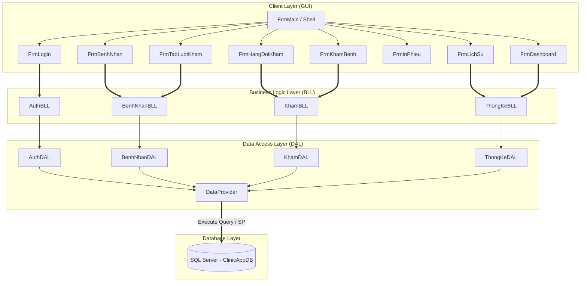

# 🏥 Hệ Thống Quản Lý Khám Bệnh Mini (Mini Clinic Management System)
> **Dự án cuối khóa môn Công nghệ Phần mềm** | Ứng dụng quản lý phòng khám quy mô vừa và nhỏ với kiến trúc **3-Layer** chuẩn chỉ, sử dụng **C# .NET 10.0**, **Windows Forms**, và **SQL Server**.

---

## 🌐 Tổng Quan Dự Án

Hệ thống **Quản Lý Khám Bệnh Mini** được xây dựng nhằm tối ưu hóa toàn bộ luồng vận hành của một phòng khám đa khoa thu nhỏ. Dự án số hóa quy trình từ khâu đăng nhập hệ thống, tiếp nhận bệnh nhân, xếp số thứ tự tự động theo ngày, điều phối hàng đợi bác sĩ, ghi nhận chẩn đoán & kê đơn thuốc cho đến việc in phiếu khám, tra cứu lịch sử bệnh án và biểu diễn số liệu trực quan trên Dashboard.

Dự án nhấn mạnh vào **kiến trúc phân lớp sạch sẽ (3-Layer)**, kiểm soát đồng thời ở tầng CSDL để tránh xung đột dữ liệu (Concurrency Control), và thiết kế giao diện thân thiện, dễ vận hành cho các vai trò nhân viên trong phòng khám.

---

## 🏗️ Kiến Trúc Hệ Thống & Nguyên Tắc Thiết Kế

Hệ thống tuân thủ chặt chẽ mô hình kiến trúc **3-Layer Architecture** giúp tách biệt rõ ràng các trách nhiệm (Separation of Concerns), tăng cường khả năng bảo trì và bảo mật:



### Nguyên Tắc Thiết Kế Không Thể Thương Lượng (Non-Negotiable Rules)
*   **Chiều phụ thuộc đơn hướng**: `GUI → BLL → DAL → DataProvider → SQL Server`. Tuyệt đối tầng dưới không biết thông tin của tầng trên.
*   **Không viết SQL trực tiếp ở GUI**: Giao diện chỉ nhận dữ liệu từ người dùng, gọi BLL để xử lý nghiệp vụ/validate, không chứa bất kỳ chuỗi truy vấn SQL nào.
*   **Quản lý kết nối an toàn**: Toàn bộ kết nối SQL được mở và đóng tự động bằng block `using` thông qua lớp `DataProvider` dùng chung, bắt lỗi tập trung và ghi log chi tiết tại `%LocalAppData%\ClinicApp\error.log`.
*   **DTO làm cầu nối dữ liệu**: Trao đổi dữ liệu giữa các lớp thông qua các đối tượng DTO chuyên biệt (`NhanVienDTO`, `BenhNhanDTO`, `LuotKhamDTO`, `ChiTietKhamDTO`).

---

## 💎 Các Tính Năng Cốt Lõi

1.  **Màn Hình Đăng Nhập & Phân Quyền (`FrmLogin` & `FrmMain`)**:
    *   Hệ thống xác thực mật khẩu qua mã hóa **SHA-256**.
    *   Phân quyền động theo 2 vai trò chính: **Tiếp Nhận (`TiepNhan`)** và **Bác Sĩ (`BacSi`)**. Sidebar tự động ẩn/hiện chức năng tương ứng với quyền của tài khoản đăng nhập.
2.  **Quản Lý & Tìm Kiếm Bệnh Nhân (`FrmBenhNhan`)**:
    *   Tìm kiếm thông minh đa cột bằng từ khóa (tìm theo Tên, Số điện thoại hoặc CCCD).
    *   Validate dữ liệu chặt chẽ ở BLL (Họ tên không rỗng, SĐT đúng chuẩn không trùng, CCCD đủ 12 số không trùng và cho phép NULL).
3.  **Tiếp Nhận Khám & Tạo Lượt Khám (`FrmTaoLuotKham`)**:
    *   Đăng ký lượt khám cho bệnh nhân, chọn bác sĩ chỉ định.
    *   Hệ thống tự động trả về số thứ tự (STT) khám bệnh bắt đầu từ `1` mỗi ngày.
4.  **Hàng Đợi Khám Của Bác Sĩ (`FrmHangDoiKham`)**:
    *   Hiển thị danh sách bệnh nhân đang ở trạng thái **Đang chờ (`DangCho`)** theo đúng thứ tự đăng ký.
    *   Cơ chế chọn bệnh nhân và chuyển sang phòng khám **Đang khám (`DangKham`)** một cách an toàn.
5.  **Phòng Khám Lâm Sàng (`FrmKhamBenh`)**:
    *   Bác sĩ nhập Triệu chứng, Chẩn đoán, kê Toa thuốc, ghi Lời dặn.
    *   Bấm hoàn tất để lưu thông tin chi tiết và cập nhật lượt khám sang **Đã khám (`DaKham`)**.
6.  **In Phiếu Khám & Print Preview (`FrmInPhieu`)**:
    *   Hiển thị thông tin phiếu khám bệnh trực quan (Print Preview) giúp bác sĩ hoặc bệnh nhân xem lại đơn thuốc và lời dặn mà không phụ thuộc máy in vật lý.
7.  **Tra Cứu Lịch Sử Khám (`FrmLichSu`)**:
    *   Lọc bệnh án lịch sử theo khoảng thời gian và theo từ khóa (Mã BN, Tên, SĐT, CCCD).
8.  **Dashboard Thống Kê (`FrmDashboard`)**:
    *   Biểu đồ và số liệu trực quan thống kê lượng bệnh nhân đến khám trong vòng 7 ngày qua.

---

## 📊 Bảng Phân Công & Đóng Góp Chi Tiết (Dành Cho Nhà Tuyển Dụng)

Dự án được phát triển theo mô hình nhóm 3 thành viên. Để đảm bảo tính nhất quán của hệ thống và tránh conflict khi làm việc nhóm, các thành viên đã chốt trước **hợp đồng giao tiếp (API Contract)**. Dưới đây là phân công chi tiết và đóng góp thực tế của từng thành viên, giúp nhà tuyển dụng đánh giá chính xác năng lực cá nhân trong dự án chung:

### 👑 Nguyễn Bảo Châu (Lead Developer & System Architect) - @NguyenBaoChau2203
Với vai trò nhóm trưởng, **Nguyễn Bảo Châu** chịu trách nhiệm thiết kế toàn bộ kiến trúc hệ thống, cơ sở dữ liệu, xây dựng toàn bộ giao diện (GUI) và trực tiếp phát triển các giải pháp xử lý đồng thời, bảo mật cốt lõi, trước khi tích hợp code từ các thành viên khác.

*   **Thiết kế kiến trúc hệ thống (Architecture & Core Framework)**:
    *   Thiết lập cấu trúc Solution 3 lớp chuẩn chỉ, chia dự án thành 4 projects độc lập (`DTO`, `DAL`, `BLL`, `GUI`).
    *   Định nghĩa toàn bộ các DTO (`NhanVienDTO`, `BenhNhanDTO`, `LuotKhamDTO`, `ChiTietKhamDTO`) và thiết kế **hợp đồng giao tiếp (API Contract)** giữa các lớp để các thành viên khác làm cơ sở triển khai logic.
    *   Xây dựng lớp `DataProvider` dùng chung, đóng gói các phương thức kết nối CSDL, gọi SQL / Stored Procedure an toàn bằng cơ chế `using` và quản lý log lỗi tập trung tại `%LocalAppData%`.
*   **Thiết kế cơ sở dữ liệu (Database Design & Constraints)**:
    *   Thiết kế toàn bộ Database Schema `ClinicAppDB` với các bảng dữ liệu liên kết chặt chẽ.
    *   Cài đặt các ràng buộc toàn vẹn dữ liệu ở tầng CSDL: các khóa ngoại, khóa duy nhất phức hợp (`UNIQUE` trên `NgayKhamDate` + `SoThuTu`), chỉ mục độc nhất có điều kiện (`Unique Index` cho `CCCD` nullable và `SDT`), và các kiểm tra miền giá trị (`CHECK` cho `VaiTro` và `TrangThai`).
    *   Thiết lập bộ dữ liệu demo đầy đủ (tài khoản nhân viên, bệnh nhân, lịch sử khám cũ) giúp ứng dụng có sẵn dữ liệu trực quan khi chạy thử nghiệm.
*   **Phát triển CSDL nâng cao & Xử lý đồng thời (Advanced SQL & Concurrency Control)**:
    *   **Stored Procedure `sp_TaoLuotKham`**: Sử dụng Transaction kết hợp với khóa độc quyền dòng `MERGE BoDemSoThuTu WITH (HOLDLOCK)` nhằm sinh số thứ tự khám an toàn, giải quyết triệt để lỗi xung đột tranh chấp số thứ tự khi có nhiều máy tiếp nhận tạo lượt khám đồng thời.
    *   **Stored Procedure `sp_HoanTatKham`**: Sử dụng Transaction bảo đảm tính toàn vẹn nguyên tố (Atomicity), vừa chèn thông tin toa thuốc (`ChiTietKham`) vừa cập nhật trạng thái lượt khám (`DaKham`), tích hợp cơ chế guard ngăn chặn click đúp gây lưu trùng dữ liệu (Double-Save).
*   **Xây dựng toàn bộ Giao diện WinForms (Entire GUI Layer - 100%)**:
    *   Tự tay thiết kế và lập trình giao diện cho toàn bộ các màn hình trong ứng dụng bao gồm: Shell chính điều hướng (`FrmMain`), màn hình Đăng nhập (`FrmLogin`), Quản lý bệnh nhân (`FrmBenhNhan`), Tiếp nhận lượt khám (`FrmTaoLuotKham`), Hàng đợi bác sĩ (`FrmHangDoiKham`), Màn hình khám bệnh lâm sàng (`FrmKhamBenh`), Form in và xem trước phiếu khám (`FrmInPhieu`), Tra cứu lịch sử (`FrmLichSu`), và Dashboard thống kê (`FrmDashboard`).
*   **Bảo mật & Phân quyền (Security & Dynamic Authorization)**:
    *   Phát triển module đăng nhập bảo mật, áp dụng thuật toán mã hóa băm một chiều **SHA-256** ở tầng BLL để mã hóa mật khẩu trước khi gửi xuống DAL so khớp.
    *   Xử lý phân quyền động (Role-based UI control) ẩn/hiện các chức năng trên thanh Menu dựa trên vai trò `TiepNhan` hoặc `BacSi` của tài khoản đăng nhập thành công.
*   **Phân tích & Thống kê (Analytics Logic)**:
    *   Tự viết module `ThongKeBLL` và `ThongKeDAL` xử lý các câu lệnh SQL nâng cao (sử dụng CTE, Group By) để lấy dữ liệu số lượng bệnh nhân theo từng ngày trong 7 ngày gần nhất, đưa lên biểu đồ trực quan ở giao diện Dashboard.
*   **Tích hợp hệ thống & Kiểm thử (Integration & E2E Testing)**:
    *   Trực tiếp tích hợp các hàm logic BLL/DAL do các thành viên khác viết vào tầng giao diện GUI.
    *   Tiến hành kiểm thử hộp đen toàn bộ luồng demo End-to-End, tối ưu hóa trải nghiệm người dùng (ví dụ: cơ chế giữ focus dòng được chọn trong DataGridView theo `MaLK` sau khi reload dữ liệu để tránh nhảy dòng nhảy màn hình).

### 👥 Các Thành Viên Đồng Phát Triển

| Thành viên | Vai trò | Đóng góp chi tiết (Phần logic tầng dưới) |
| :--- | :--- | :--- |
| **Dư (Receptionist)** | Cài đặt logic module Tiếp nhận | <ul><li>Viết các hàm ở tầng BLL/DAL quản lý thông tin bệnh nhân: `TimBenhNhan` (tìm kiếm thông minh đa cột), `LayBenhNhanTheoMa`, `ThemBenhNhan`, và `CapNhatBenhNhan` có validate định dạng.</li><li>Viết hàm logic tầng dưới để đăng ký khám bệnh (`TaoLuotKham` gọi xuống `sp_TaoLuotKham`).</li><li>Viết hàm hủy lượt khám an toàn (`HuyLuotKham`), kiểm tra điều kiện trạng thái phải là `DangCho` và áp dụng kiểm tra `RowsAffected == 1` để đảm bảo tính atomic.</li></ul> |
| **Hùng (Doctor)** | Cài đặt logic module Bác sĩ | <ul><li>Viết các hàm ở tầng BLL/DAL phục vụ phòng khám của bác sĩ: `LayHangDoiDangCho` (chỉ load các lượt khám có trạng thái `DangCho`).</li><li>Cài đặt hàm bắt đầu khám bệnh (`ChuyenSangDangKham`), thực hiện cập nhật trạng thái atomic `DangCho → DangKham` có điều kiện nhằm ngăn chặn việc 2 bác sĩ cùng nhận chung 1 bệnh nhân.</li><li>Cài đặt hàm hoàn tất khám bệnh (`HoanTatKham` gọi xuống `sp_HoanTatKham`).</li><li>Cài đặt logic lấy dữ liệu in phiếu khám bệnh (`LayDuLieuInPhieu`) và hàm chuyển ngược bệnh nhân về hàng đợi chờ nếu cần thiết (`ChuyenVeDangCho`).</li></ul> |

---

## 🔒 Giải Pháp Kỹ Thuật Nổi Bật & Concurrency Control

Dự án áp dụng nhiều giải pháp kỹ thuật sâu sắc ở tầng cơ sở dữ liệu để bảo vệ tính toàn vẹn của dữ liệu trong môi trường nhiều người dùng đồng thời:

### 1. Sinh Số Thứ Tự An Toàn (Concurrency-Safe Ticket Numbering)
Trong một phòng khám, việc nhiều nhân viên tiếp nhận tạo lượt khám cùng một lúc rất dễ dẫn đến việc cấp trùng Số Thứ Tự (STT) khám bệnh trong cùng một ngày. Dự án giải quyết triệt để bằng Stored Procedure `sp_TaoLuotKham` có cấu trúc:

```sql
CREATE PROCEDURE sp_TaoLuotKham
    @MaBN INT,
    @MaBacSi INT = NULL,
    @GhiChu NVARCHAR(255) = NULL,
    @MaLK INT OUTPUT,
    @SoThuTu INT OUTPUT
AS
BEGIN
    SET NOCOUNT ON;
    DECLARE @Now DATETIME = GETDATE();
    DECLARE @Ngay DATE = CAST(@Now AS DATE);

    BEGIN TRY
        BEGIN TRANSACTION;

        -- Sử dụng MERGE kết hợp gợi ý khóa HOLDLOCK (tương đương SERIALIZABLE) 
        -- để khóa dòng đếm số thứ tự của ngày hiện tại, tránh Race Condition
        MERGE BoDemSoThuTu WITH (HOLDLOCK) AS Target
        USING (SELECT @Ngay AS Ngay) AS Source
        ON (Target.NgayKham = Source.Ngay)
        WHEN MATCHED THEN
            UPDATE SET @SoThuTu = Target.SoCuoi + 1, Target.SoCuoi = Target.SoCuoi + 1
        WHEN NOT MATCHED THEN
            INSERT (NgayKham, SoCuoi) VALUES (@Ngay, 1);

        IF @SoThuTu IS NULL
            SET @SoThuTu = 1;

        -- Thêm mới lượt khám
        INSERT INTO LuotKham (MaBN, SoThuTu, NgayKham, NgayKhamDate, TrangThai, MaBacSi, GhiChu)
        VALUES (@MaBN, @SoThuTu, @Now, @Ngay, 'DangCho', @MaBacSi, @GhiChu);

        SET @MaLK = SCOPE_IDENTITY();

        COMMIT TRANSACTION;
    END TRY
    BEGIN CATCH
        IF @@TRANCOUNT > 0
            ROLLBACK TRANSACTION;
        THROW;
    END CATCH
END
```

### 2. Chuyển Đổi Trạng Thái Lượt Khám Hợp Lệ (Atomic State Transitions)
Để tránh tình trạng hai bác sĩ cùng kích chọn bắt đầu khám cho một bệnh nhân tại cùng một thời điểm, hoặc nhân viên tiếp nhận hủy một lượt khám đã được bác sĩ nhận khám, hệ thống sử dụng cơ chế cập nhật trạng thái có điều kiện (Atomic State Transition):

```csharp
// DAL kiểm tra số dòng bị ảnh hưởng (RowsAffected)
public bool ChuyenSangDangKham(int maLK, int maBacSi)
{
    string query = @"
        UPDATE LuotKham 
        SET TrangThai = 'DangKham', MaBacSi = @MaBacSi 
        WHERE MaLK = @MaLK AND TrangThai = 'DangCho'"; // Chỉ cập nhật nếu trạng thái hiện tại là DangCho

    int rowsAffected = DataProvider.Instance.ExecuteNonQuery(query, new object[] { maBacSi, maLK });
    return rowsAffected == 1; // Trả về true nếu cập nhật thành công đúng 1 dòng
}
```
Nếu `rowsAffected == 0`, hệ thống BLL trả về `false`, GUI sẽ tự động reload lại hàng đợi và thông báo nhẹ nhàng cho bác sĩ thứ hai biết bệnh nhân đã được nhận bởi bác sĩ khác, đảm bảo không xảy ra xung đột dữ liệu.

### 3. Chống Lưu Khám Trùng (Double-Save Prevention)
Khi hoàn tất khám, bác sĩ bấm nút "Lưu". Nhằm ngăn ngừa việc click đúp hoặc gửi yêu cầu trùng lặp làm hỏng dữ liệu, Stored Procedure `sp_HoanTatKham` được trang bị cơ chế kiểm tra điều kiện trạng thái của lượt khám trước khi insert toa thuốc:

```sql
CREATE PROCEDURE sp_HoanTatKham
    @MaLK INT,
    @TrieuChung NVARCHAR(255),
    @ChanDoan NVARCHAR(255),
    @ToaThuoc NVARCHAR(MAX),
    @LoiDan NVARCHAR(255),
    @KetQua BIT OUTPUT
AS
BEGIN
    SET NOCOUNT ON;
    SET @KetQua = 0;

    BEGIN TRY
        BEGIN TRANSACTION;

        -- Khóa dòng lượt khám để kiểm tra trạng thái
        DECLARE @TrangThai VARCHAR(20);
        SELECT @TrangThai = TrangThai 
        FROM LuotKham WITH (UPDLOCK) 
        WHERE MaLK = @MaLK;

        -- Chỉ cho phép hoàn tất nếu lượt khám đang ở trạng thái 'DangKham' 
        -- và chưa tồn tại chi tiết khám tương ứng
        IF @TrangThai = 'DangKham' AND NOT EXISTS (SELECT 1 FROM ChiTietKham WHERE MaLK = @MaLK)
        BEGIN
            INSERT INTO ChiTietKham (MaLK, TrieuChung, ChanDoan, ToaThuoc, LoiDan)
            VALUES (@MaLK, @TrieuChung, @ChanDoan, @ToaThuoc, @LoiDan);

            UPDATE LuotKham 
            SET TrangThai = 'DaKham' 
            WHERE MaLK = @MaLK;

            SET @KetQua = 1;
        END

        COMMIT TRANSACTION;
    END TRY
    BEGIN CATCH
        IF @@TRANCOUNT > 0
            ROLLBACK TRANSACTION;
        SET @KetQua = 0;
        THROW;
    END CATCH
END
```

---

## 🚀 Hướng Dẫn Cài Đặt & Triển Khai Nhanh

### Yêu Cầu Hệ Thống
*   Hệ điều hành: Windows 10/11
*   Công cụ phát triển: **Visual Studio 2022** (hỗ trợ .NET 10.0 SDK)
*   Hệ quản trị CSDL: **Microsoft SQL Server 2022** (hoặc Express Edition)

### Các Bước Triển Khai

1.  **Cài Đặt Cơ Sở Dữ Liệu**:
    *   Mở SQL Server Management Studio (SSMS).
    *   Mở tệp tin script [Setup.sql](file:///c:/Users/chau1/source/repos/NguyenBaoChau2203/Quan_Ly_Kham_Benh_Mini/sql/Setup.sql) có sẵn trong thư mục `sql/`.
    *   Chạy toàn bộ script để tự động tạo cơ sở dữ liệu `ClinicAppDB`, thiết lập các bảng, stored procedure, chỉ mục và chèn dữ liệu demo.
    *   *(Lưu ý: Có sẵn file backup `.bak` dự phòng trong thư mục `sql/backup/` nếu bạn muốn restore trực tiếp).*

2.  **Cấu Hình Kết Nối**:
    *   Mở Visual Studio, nạp Solution [ClinicApp.sln](file:///c:/Users/chau1/source/repos/NguyenBaoChau2203/Quan_Ly_Kham_Benh_Mini/src/ClinicApp.sln) nằm trong thư mục `src/`.
    *   Mở file cấu hình kết nối `App.config` trong project `ClinicApp.GUI`.
    *   Thay đổi thuộc tính `connectionString` tại thẻ `<connectionStrings>` cho phù hợp với máy của bạn:
        ```xml
        <connectionStrings>
            <add name="ClinicAppDB" 
                 connectionString="Data Source=YOUR_SERVER_NAME;Initial Catalog=ClinicAppDB;Integrated Security=True;TrustServerCertificate=True" 
                 providerName="System.Data.SqlClient" />
        </connectionStrings>
        ```

3.  **Biên Dịch & Khởi Chạy**:
    *   Đặt project `ClinicApp.GUI` làm **Startup Project**.
    *   Bấm **F5** hoặc chọn nút **Start** để biên dịch ứng dụng và khởi chạy giao diện đăng nhập.

---

## 🏁 Kịch Bản Thử Nghiệm Luồng Nghiệp Vụ (Demo Flow)

Để kiểm thử nhanh toàn bộ hệ thống, bạn có thể thực hiện theo kịch bản chuẩn sau bằng cách sử dụng các tài khoản demo đã được tích hợp sẵn:

1.  **Đăng Nhập Tiếp Nhận**:
    *   Tài khoản: `tiepnhan` | Mật khẩu: `123`
    *   *Hệ thống tự động hiển thị các chức năng: Quản lý bệnh nhân, Tạo lượt khám.*
2.  **Đăng Ký Khám Mới**:
    *   Vào mục **Bệnh Nhân**: Nhập từ khóa để tìm kiếm bệnh nhân cũ hoặc bấm "Thêm bệnh nhân" để nhập hồ sơ mới (validate định dạng SĐT và CCCD hoạt động).
    *   Vào mục **Đăng Ký Khám**: Chọn bệnh nhân vừa tìm/thêm, chọn Bác sĩ chỉ định, nhập Lý do khám, bấm "Đăng ký".
    *   *Màn hình hiển thị số thứ tự (STT) khám bệnh được cấp (ví dụ: Số 1, Số 2).*
3.  **Đăng Nhập Bác Sĩ**:
    *   Đăng xuất tài khoản Tiếp nhận, đăng nhập với tài khoản: `bacsi` | Mật khẩu: `123`
    *   *Hệ thống ẩn menu Tiếp nhận, hiển thị các menu: Hàng đợi khám, Khám bệnh, In phiếu.*
4.  **Thực Hiện Khám Lâm Sàng**:
    *   Vào mục **Hàng Đợi Khám**: Thấy danh sách bệnh nhân đang chờ. Chọn bệnh nhân vừa được tạo lượt khám và bấm **Bắt đầu khám** (trạng thái chuyển thành `DangKham`).
    *   Vào màn hình **Khám Bệnh**: Ghi nhận các triệu chứng, chẩn đoán, kê đơn thuốc và ghi lời dặn chi tiết, sau đó bấm **Lưu & Xem phiếu**.
    *   *Hệ thống chuyển trạng thái lượt khám sang `DaKham`.*
5.  **Xem Phiếu & Thống Kê**:
    *   Màn hình **In Phiếu** tự động hiển thị thông tin toa thuốc vừa lưu dạng Print Preview đẹp mắt.
    *   Đăng nhập lại hoặc chuyển sang các màn hình phụ trợ để xem **Lịch sử khám bệnh** đa tiêu chí và biểu đồ thống kê 7 ngày tại **Dashboard**.

---

## 📁 Cấu Trúc Thư Mục Dự Án

```text
Quan_Ly_Kham_Benh_Mini/
│
├── design/              # Các UI mockup và layout tham khảo (Google Stitch export)
├── docs/                # Tài liệu chuẩn triển khai,Master Plan và kịch bản phân công
│   ├── tasks/           # Chi tiết mô tả phân công nhiệm vụ của từng thành viên
│   └── Master_Plan.md   # Kế hoạch tổng thể và quy định kỹ thuật của dự án
│
├── sql/                 # Chứa script cài đặt CSDL và các bản backup
│   ├── Setup.sql        # Script SQL thiết lập DB và Stored Procedures hoàn chỉnh
│   └── backup/          # Thư mục chứa file sao lưu .bak của CSDL
│
└── src/                 # Mã nguồn C# Visual Studio Solution
    ├── ClinicApp.sln    # Solution chính nạp dự án
    ├── ClinicApp.DTO/   # Lớp vận chuyển dữ liệu (Data Transfer Objects)
    ├── ClinicApp.DAL/   # Lớp truy cập cơ sở dữ liệu (Data Access Layer)
    ├── ClinicApp.BLL/   # Lớp xử lý logic nghiệp vụ (Business Logic Layer)
    └── ClinicApp.GUI/   # Giao diện người dùng đồ họa Windows Forms (Presentation Layer)
```

---

## 📞 Liên Hệ & Thông Tin Tác Giả

Nếu bạn là nhà tuyển dụng và muốn trao đổi thêm về các giải pháp kỹ thuật, cấu trúc mã nguồn hoặc khả năng làm việc nhóm/quản lý dự án của tôi, vui lòng liên hệ:

*   **Họ và tên**: Nguyễn Bảo Châu
*   **Vai trò dự án**: Nhóm trưởng & Kiến trúc sư chính
*   **GitHub**: [@NguyenBaoChau2203](https://github.com/NguyenBaoChau2203)
*   **Email**: *[Cập nhật email của bạn tại đây]*
*   **Điện thoại**: *[Cập nhật số điện thoại của bạn tại đây]*

---
*Cảm ơn thầy và các nhà tuyển dụng đã dành thời gian xem xét dự án này!*
